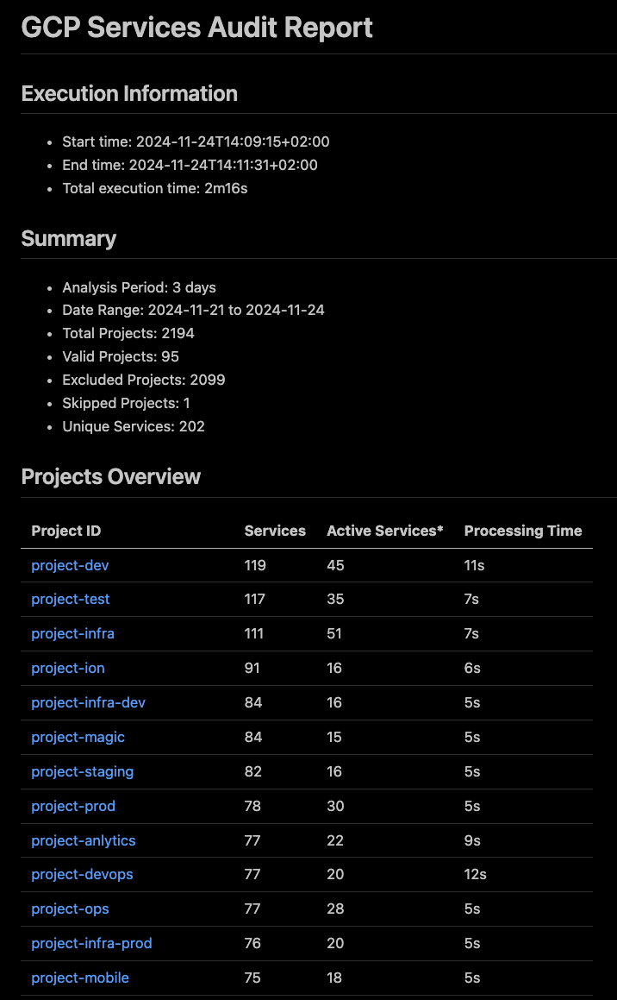
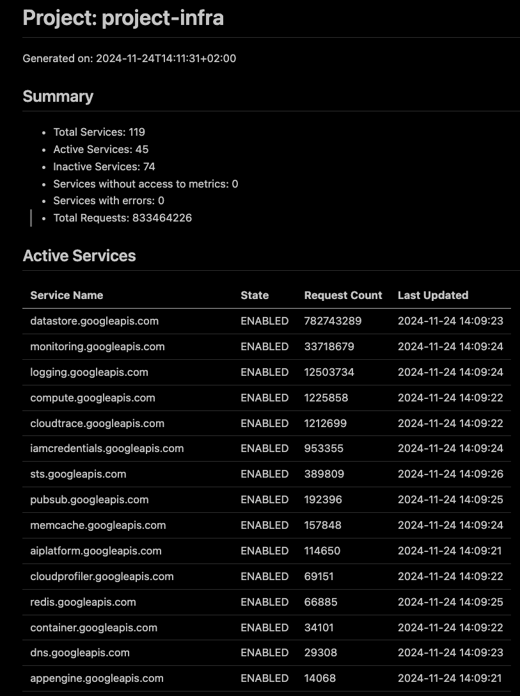

# GCP Auditor

[](https://opensource.org/licenses/MIT)
[](https://github.com/ybonda/go-gcp-auditor/releases)


GCP Auditor is a powerful command-line tool for auditing Google Cloud Platform services across all your projects. It helps identify enabled services, analyze their usage patterns, and generate comprehensive reports for better cloud resource management.

## Features

- 🔍 **Comprehensive Scanning**: Automatically discovers and analyzes all accessible GCP projects
- 📊 **Usage Analysis**: Tracks service usage patterns over customizable time periods
- 📝 **Detailed Reports**: Generates Markdown reports with project-specific details and statistics
- 🚀 **Concurrent Processing**: Efficiently processes multiple projects simultaneously
- 🔒 **Safe Execution**: Respects GCP permissions and handles rate limiting automatically

## Example Report Output





The tool generates comprehensive reports that include:

- Execution information with timing details
- Summary statistics of analyzed projects and services
- Projects overview with service counts and processing times

## Installation

### Using Go Install

```bash
go install github.com/ybonda/gcp-auditor@latest
```

### From Source

```bash
git clone https://github.com/ybonda/gcp-auditor.git
cd gcp-auditor
make build
```

## Prerequisites

1. Go 1.22 or higher
2. GCP credentials with appropriate permissions:
   - `resourcemanager.projects.list`
   - `serviceusage.services.list`
   - `monitoring.timeSeries.list`

## Authentication

Before running GCP Auditor, you need to authenticate with Google Cloud Platform. You can do this in two ways:

### Option 1: Using gcloud CLI

```bash
gcloud auth application-default login
```

### Option 2: Using Service Account Key

```bash
export GOOGLE_APPLICATION_CREDENTIALS="/path/to/service-account-key.json"
```

## Usage

### Basic Usage

```bash
# Run audit with default settings (30 days lookback)
gcp-auditor audit

# Run audit with custom time period
gcp-auditor audit --days 60

# Enable verbose output
gcp-auditor audit --verbose

# Specify custom output directory
gcp-auditor audit --output-dir "./my-reports"
```

### Configuration Options

| Flag          | Description                              | Default     |
|---------------|------------------------------------------|-------------|
| `--days`      | Number of days to analyze                | 30         |
| `--output-dir`| Directory for report output              | "./reports" |
| `--verbose`   | Enable detailed logging                  | false      |
| `--config`    | Path to config file                      | -          |

## Output

GCP Auditor generates a structured report directory containing:

```bash

reports/
└── 20241124_150405/         # Timestamp directory
    ├── report.md                    # Main report
    └── projects_report/          # Project reports directory
        ├── project-1.md
        ├── project-2.md
        └── ...
```

## Development

### Building from Source

```bash
# Build the binary
make build

# Run tests
make test

# Run linter
make lint

# Clean build artifacts
make clean
```

## License

This project is licensed under the MIT License - see the [LICENSE](LICENSE) file for details.

---

❤️
